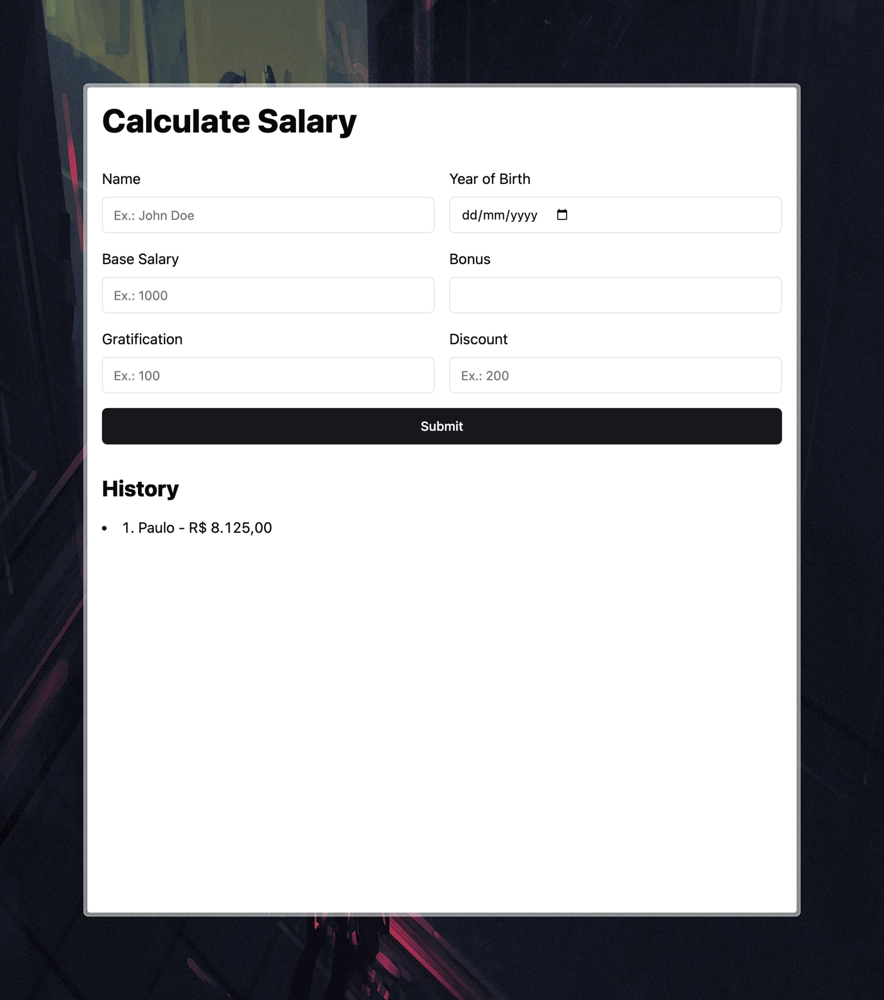

# Calculate Salary Project

> This is a re-creation of [04_calculate_salary](../04_calculate_salary) with
> the addition of UnoCSS, Vite, and my own jQuery-inspired library
> [not-jquery](../../../packages/not-jquery).
>
> This version also implements local history persistence with `localStorage`.

Calculate final salary through form submission.



- TypeScript
- HTML forms
- UnoCSS
- DOM manipulation
- [not-jquery](https://www.npmjs.com/package/@raggesilver/not-jquery)

## How to run/open

```sh
bun install

# development
bun dev
# or
bun run build
bunx serve dist
```
